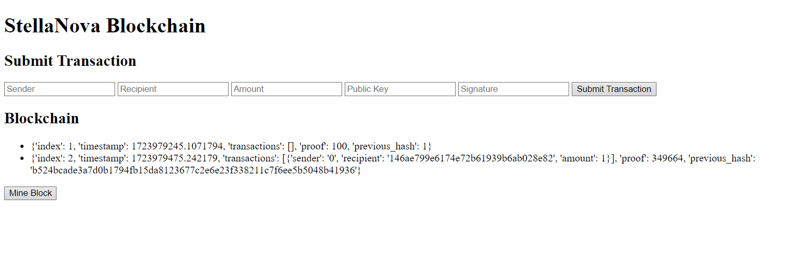

# StellaNova

## Description

StellaNova is a blockchain for the StellaNova coin. It is a simple blockchain that allows for the creation of new blocks, the mining of new blocks, and the validation of blocks. The blockchain is written in Python and uses the Flask web framework to create a simple web interface for interacting with the blockchain.

## Improvements

- [ ] Add a simple wallet explorer for viewing wallets
- [ ] Add a simple transaction explorer for viewing transactions
- [ ] Add a simple mining explorer for viewing mining statistics
- [ ] Improve the mining algorithm to be more secure
- [ ] Improve the web interface to be more user-friendly and with more features
- [ ] Use all the features of the blockchain in a real-world application

## Requirements

python >= 3.9

To run the project, you need to have Python installed on your machine. You can download Python from the [official website](https://www.python.org/downloads/)

**Setting Up the Environment**

* Windows: `./setup_Windows.bat`
* Linux/macOS: `./setup_Linux.sh`

These scripts will install required dependencies, and build a virtual environment for you if you don't have one.

## Usage

Run the script `./run.bat` on Windows to auto-run the base app for the blockchain.
I will add a new script for Linux in the future.

The app will be found at "http://127.0.0.1:5000".

Each module has it's own testing functin in case you want to use the code in one of your programs.

## License

This project is licensed under the MIT License - see the LICENSE.md file for details

## Author

[Neetre](https://github.com/Neetre)
